# Had2Apps.Materials
Had2Appsのフリー素材置き場。

## オリジナル素材
### RPGツクールMV専用 SF素材
#### 利用規約

<details><summary>CLICK ME</summary><p>

##### 著作権
- 素材を利用する場合は必ず著作の表記をお願いします。（イベントやテレビ番組など表記が不可能の場合は例外とします。）
```
表記例：
　Had2Apps
　http://had2apps.com/
```
- 「ニコニ・コモンズの素材」の場合は、ニコニコ動画内での使用に限り、素材をコンテンツツリーの親作品に登録をお願いします。
##### 利用に関して
- 素材の利用報告は任意です。
- 有料作品、アダルト作品での使用...
```
オリジナル素材の場合：　許可します。
二次創作素材の場合：　各素材の項目に記された規約を守ってください。
```
##### 素材の改変、二次配布に関して
- 素材を改変して使用することは自由です。
- 素材を改変したものを公開・配布したい場合...
```
オリジナル素材の場合：　Had2Appsの素材を改変した旨を必ず記載してください。
二次創作素材の場合：　各素材の項目に記された規約を守ってください。
```
- 改変していない素材を二次配布したい場合...
```
オリジナル素材の場合：　必ずHad2Appsの許可を得てください。
二次創作素材の場合：　各素材の項目に記された規約を守ってください。
```
##### 禁止事項
- 規約を違反すること。
- 許可なく未改変素材を二次配布する事。
- 著作を偽ること。
　
規約違反と著作者が認めた利用を発見次第、権利保有者として権利侵害の申立を行う場合があります。また、改善が見られない場合や大きな損害へ発展した場合は、法的な措置を取ることがあります。
　
（禁止事項にどうしても抵触した利用を行いたい場合は、条件によっては別途ライセンス契約を行える場合があります。メールかTwitterからご相談ください。）

##### クリエイティブ・コモンズ・ライセンス
Had2Appsのオリジナル素材は **[クリエイティブ・コモンズ 表示 - 継承 4.0 国際 ライセンス](http://creativecommons.org/licenses/by-sa/4.0/deed.ja)** の下に提供されています。

[](http://creativecommons.org/licenses/by-sa/4.0/)

</p></details>

#### サンプル

<details><summary>CLICK ME</summary><p>

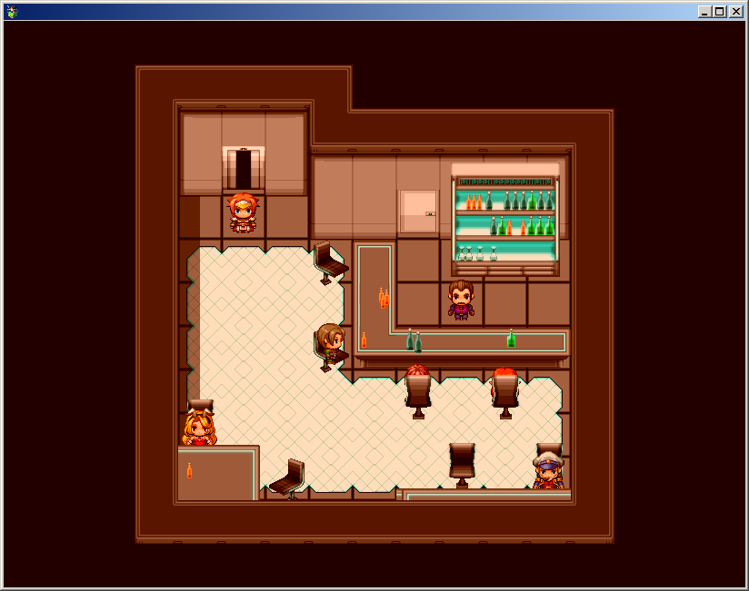

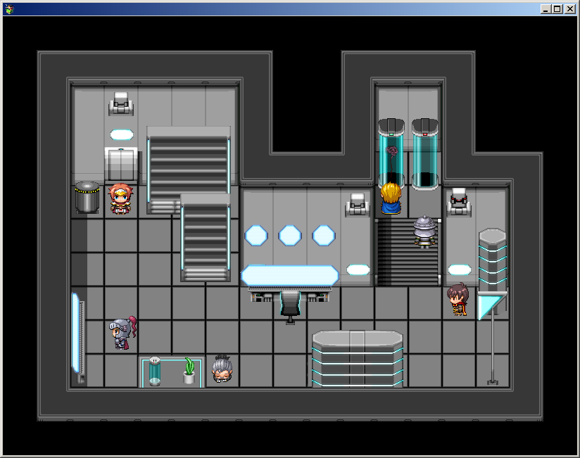

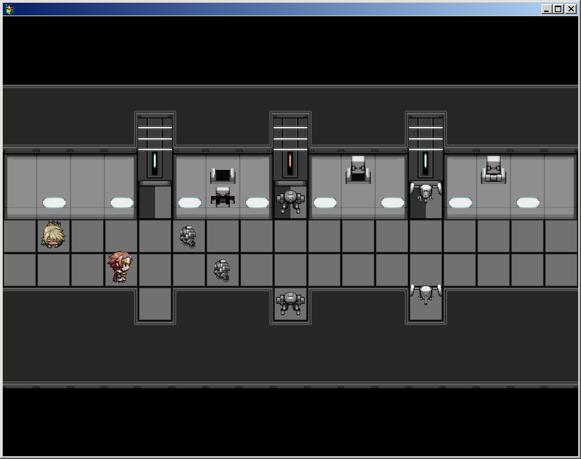

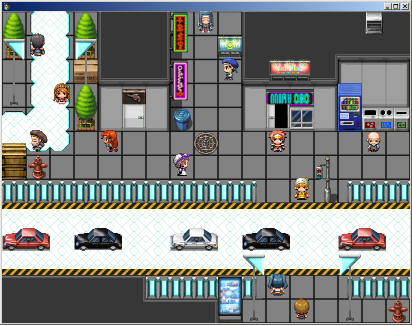

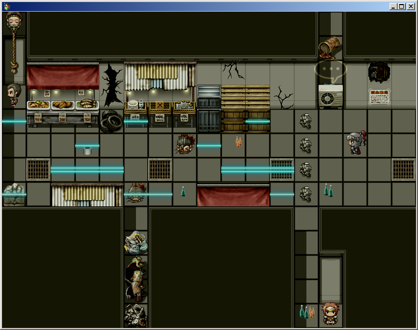

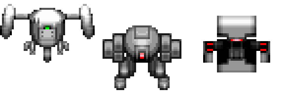

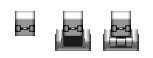

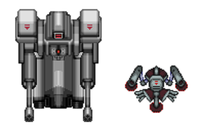

</p></details>

#### ダウンロード

<details><summary>CLICK ME</summary><p>

##### マップ
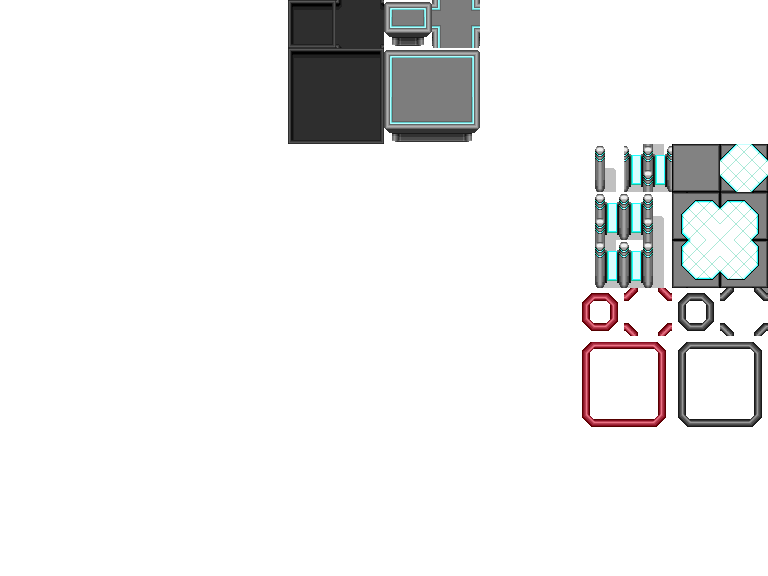

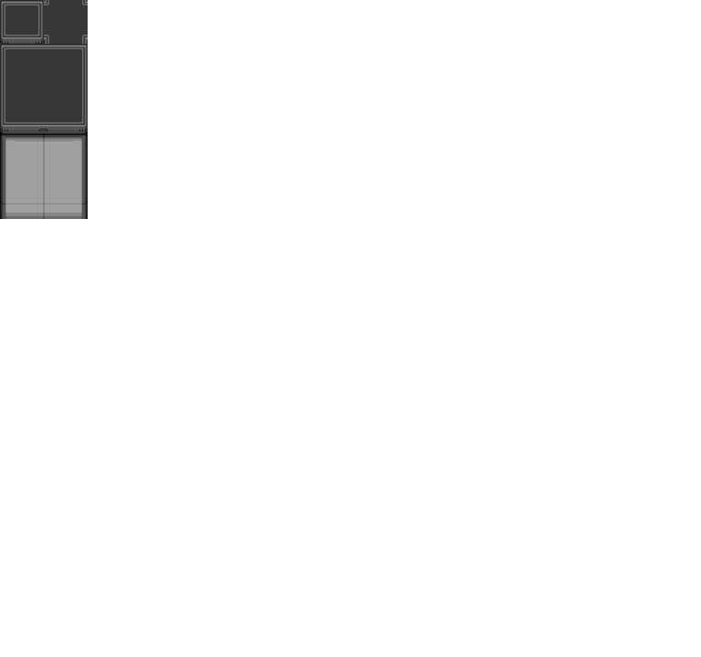

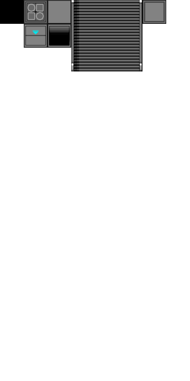


##### キャラクター
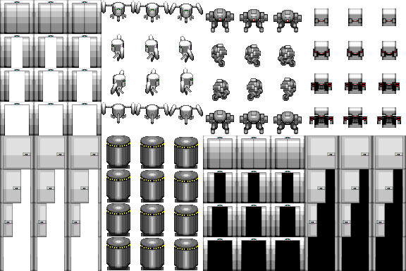


</p></details>

## ファンメイド素材
### RPGツクール2000/MV専用 SCP財団素材
#### 利用規約

<details><summary>CLICK ME</summary><p>

- この素材は「 **[SCP財団](http://ja.scp-wiki.net/)** 」を元にしており、　[クリエイティブ・コモンズ 表示-継承 3.0](https://creativecommons.org/licenses/by-sa/3.0/deed.ja)の下に提供します。そのため、著作権表記には原作である「SCP財団」を必ずクレジットしてください。
- [SCP財団ライセンスガイド](http://ja.scp-wiki.net/licensing-guide)をよく目を通し、守ってください。
- できれば素材配布元である「Had2Apps」とそのURL「 http://had2apps.com/ 」も含めてください。

</p></details>

#### ダウンロード

<details><summary>CLICK ME</summary><p>

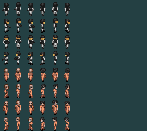

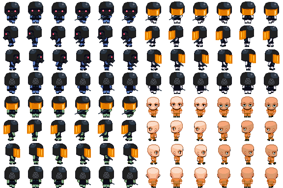

</p></details>
